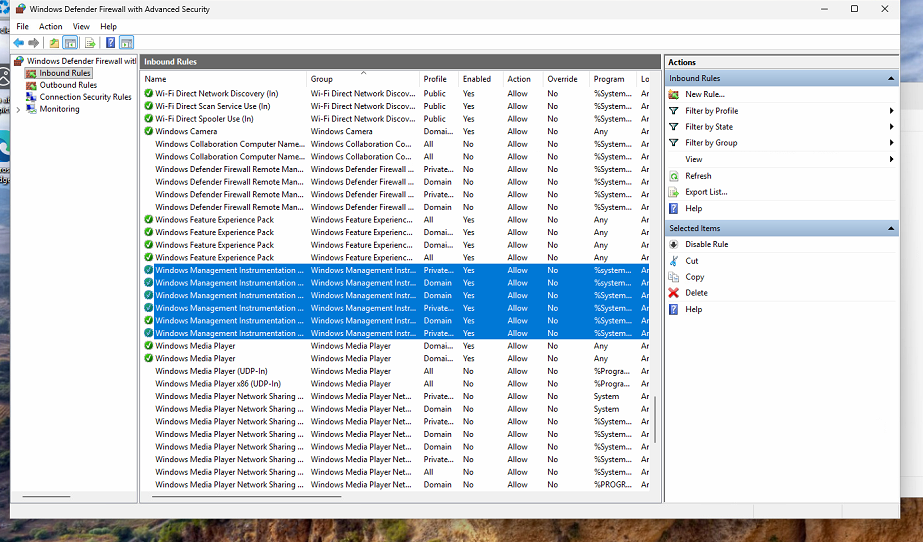

# onfiguring MECM & First Managed Device




### Setting up a Discovery Method

1. Open Microsoft Configuration Manager. Navigate to Administration > Hierarchy Configuration > Discovery Methods >  Active Directory System Discovery 
    
    
    
2. Right click on Active Directory System Discovery and go into properties. Check the Enable Active Directory Systems Discovery and then click on the yellow star 
    
    
    
3. On the Active Directory Container pop up, click on browse and select your root directory. Make sure to also check the box for Recursively search Active Directory child containers. Then click ok
    
    
    
4. Back in ADSD properties click on polling schedule tab. Make sure enable discovery. For my current lab environments scale I will set the polling schedule to run every hour
    1. To do so click on schedule and configure the recurrence pattern to be 1 hour.
        
        
        
5. Next click apply and if prompted, click yes to “Do you want to run a full discovery as soon as possible?”
    
    
    
    1. After running this we can verify it is working by reviewing the adsysdis.log. There we wills see it discover the objects for our DC and SCCM servers.
        
        
        
6. Now we will repeat the same steps (2-5) for Active Directory User Discovery (again you can check logs but this time look in adusrdis.log)
7. If you navigate to Asset and Compliance > Overview > Devices you will see your DC and SCCM servers identified. When we add client workstations we will also see them pop up here. 
8. Go back to discovery methods and right click on Active Directory Forest Discovery. Go to properties and set the properties to the following below
    
    
    

### Creating A Boundary, a Boundary Group & Verifying Distribution Point DP

1. Now navigate to Administration > Hierarchy Configuration > Boundaries. Right click on boundaries and select “Create a boundary”
    
    
    
2. Give the boundary a descriptive name. Make type “Active Directory Site” and  Click Browse.
    
    
    
3. Pick the default site and apply.
4. Now, under hierarchy configuration right click on Boundary Groups and Create Boundary Group
5. Pick a descriptive name and click on add to select the boundary we created in step 2 
    
    
    
6. Navigate to the references tab. Click on add “Use this boundary group for site assignment” and make sure the assigned site is the site code + site description you put when running the ConfigMgr installer. Click add and make sure to select your SCCM server
    
    
    
    Side note: The DP is what MECM uses to store and deliver content. i.e without a DP, MECM tell a device to install software but doesn’t have a place to get the required files for install
    
7. Lets make sure DP role was installed alongside MECM. Navigate to Administration > Site Configuration > Servers and Site System Roles. Verify you see the following 
    
    
    
8. Right lick on the Distribution point on the roles list and go to properties. 

### Join Client to Domain and Discover

1. I spun up a windows 11 VM, gave it a static IP and domain joined it. Then performed a full device discovery. 
    1. Made sure i could ping to SCCM and DC using client names.
    2. Made sure to move this device to its appropriate OU
2. Go to Windows Firewall advances settinga and enable all inbound WMI rules in the firewall settings
    
    
    
3. Go back to the MECM interface Administration > Overview > Hierarchy Configuration > Discovery Methods and Run a full Discovery now on Active directory system discovery 
    
    
    
    1. I was able to see the client in devices in MECM but in the logs I was seeing this error
        
        
        
    2. Tried to ping to the client from MECM server and realized destination host was not reachable 
    3. Realized I forgot to set domain profile to allow network discovery 
        
        
        
    4. Once done issue no longer in log and can ping from server to client device
4. If all is you should see your freshly domain joined device in the Assets and Compliance > Overview > Devices tab.


### Push MECM Client to Domain Joined Device

1. I will be performing a Client Push to install the MECM client agent on my device Client01. 
2. Lets configure client push. Navigate to Administration > Site Configuration > Sites > Client Installation Settings > Client Push Installation 
    
    
    
3. Check Enable automatic site-wide client push installation and Workstations boxes
    1. I am focusing on workstation so for now so you can leave servers unchecked. 
        
        
        
4. Go accounts tab, click on the yellow star and add an appropriate account that has admin share access or local admin rights on endpoint
    1. I went ahead and made and MECM service account with these requirements in AD
    2. Also I am going to give this account local admin access to all endpoints through a GPO so lets go on a little tangent.
    3. On the DC open Group Policy Management. Right click on domain to “Create a GPO…” and open up the GPO wizard
        
        
        
    4. Name this something descriptive (I used MECM Local Admin Access). Now right click and edit this GPO. 
    5. In the GPO editor go to Computer Configuration > Preferences > Control Panel Settings > Local Users and Groups. Right click local users and groups and go new > local group
        
        
        
    6. For action make update, make group name “Administrators (built-in)” then click add to add your service account to your local admins
        
        
        
    7. Then on client device open a command window and run 
        
        ```powershell
        gpupdate /force
        
        #and then 
        
        net localgroup administrator
        ```
        
    8. You should no see the mecm service account it the local admins group (this can also be done in gui)
    9. I also recommend doing a GPO for WMI firewall rules discussed in step 2 of join client to the domain. This way any future AD joined devices will be ready for MECM client install
        
        
        
5. Back in the Accounts Client push install properties. After clicking on yellow star click New Account. Add your service account and verify 
    
    
    
6. Next in Asset and Compliance > Devices. Right Click on the device, or highlight it and, Install client.
    
    
    
7. In the wizard installation options check “Always install the client software” and click next until finished. 
8. Now in Asset and Compliance > Devices you will see that Client01 has a green check, a site code, shows yes under client, and even who is logged in 
    
    