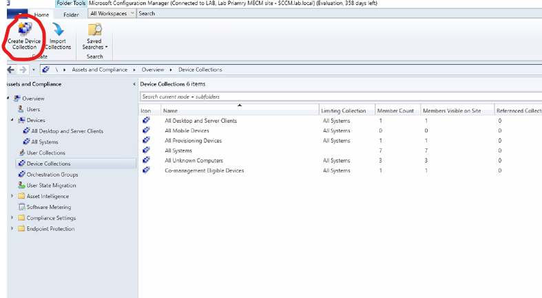

# Managing Device with MECM

### Creating collections for devices

Personal Note: This is like the first line of defense and a tool for granularity. Its like perform this actions on all these squares vs perform this action on all rectangles or parallelograms. Creates limit in scope of governance.

I am going to try to emulate “enterprise” architecture by building the following collections under all managed devices:

- All Systems
    - All Managed Clients (Anything with MECM client)
        - Windows 11 Devices (OS = Win11)
            - Pilot Ring (Direct Membership)
1. In MECM navicate to Asset and Compliance > Overview > Devices > Device collections. Click on Create Device Collection
    
    
    
2. In the general tab configure the following. Make sure to make all systems the limiting collection 
    
    
    
3. We are going to Add a rule to query devices by checking for the MECM client which can be done using the following SQL query  
    
    ```sql
    SELECT * FROM SMS_R_System WHERE SMS_R_System.Client = 1
    ```
    
4. Click on add role and select query rule.
    
    
    
5. Click on Edit Query Statement and in the Query Statement Properties click on Show Query Language
    
    
    
6. You’ll now be able to adjust the sql query statment. Type in the SQL query statement found in step three and click OK and continue through the wizard. 
7. At the end you should confirmation of a successful collection creation. Close the wizard and right click on the new All Managed Devices collection and select Update Membership
    
    
    
8. You should see the devices with an active client populate in this collection 
    
    
    
9. Now we will repeat similar steps to create a Windows 11 Devices collection. This time make the limiting collection All managed devices and the WQL statement the following 
    
    ```sql
    SELECT * FROM SMS_R_System 
    WHERE SMS_R_System.OperatingSystemNameandVersion LIKE "Microsoft Windows NT Workstation 10.0%"
    AND SMS_R_System.Build >= "10.0.22000"
    ```
    
    
    
    
    
10. Once created, update membership and to make sure this worked. 
    1. At this point I would recommend booting up a second client vm. Domain join it but do not install the MECM client yet to see the the collection distinction
11.  Now I am going create a Pilot ring collection. But for this one I am going to add it using a direct rule in the membership rules and select Client01 explicitly. 

    
    
    
12. In the Create Direct Membership Rule wizard, in search for resource configure the following and then click next
    
    
    
13. You should see your device pop up in the select resource tab. Continue to click through the wizard until you see 
    
    
    
14. Back in the collection wizard finish the set up and update membership

 

### Hardware Inventory Tool

1. Check if hardware inventory is enabled. In lab since we dont have to many devices you can change schedule to hours of small scale instead of seven days.
    
    
    
2. To run a manual hardware inventory from MECM go to the device in Assets and Compliance. Right click on the device. Navigate to Client Notification > Collect Hardware Inventory
    
    
    
3. Now highlight your device and click Start > Resource Explorer
    
    
    
4. If you go in to into Hardware > Computer System. You will see the device name, its domain, its manufacturer etc. (since this is a vm you will see unexpected values and thats okay)
    
    
    

### Software Deployment (MSI & EXE)

1. Create a repository folder on your SCCM server. Download the MSI file for 7-zip and the notepad++ installer. These are good small apps to practice on. 
    1. Note. Download a slightly older version of Notepad++ so that we can do upgrades later
    2. Once downloaded I recommend you create a dedicated software repo directory that you organize to have app folder (this emulates version control in enterprise)
2. Now lets start with MSI file apps.
    1. In MECM console navigate to Software Library > Application Management > Applications
        
        
        
    2. Click on Create Application to open the creation Wizard. For MSI files we will automatically detect information about this application. Browse for the 7zip installer in your files. 
        
        
        
    3. After clicking next you should see something like this. You can click next 
        
        
        
    4. In general information fill the data with appropriate information. Then fun through the application wizard
    5. Now right click the 7 zip application and select distribute content
        
        
        
    6. In the distribute content we want to add the SCCM server as a distribution point. So navigate through the wizard to this point and click on distribution point. Select the server.
        
        
        
        
        
    7. You can then click all the way through the distribution wizard.
    8. Now we deploy the app to Client01 using the pilot ring collection. Highlight the 7-zip Application in application management and click deploy
        
        
        
    9. In the deployment wizard for the collection click browse and select the pilot ring
        
        
        
    10. Make sure in content you see the distribution points we distributed the content to and click next. In deployment settings set action to install and purpose to required so that it is forces installation. Which we want to see. 
        1. I am not focusing on software center for now. 
    11. In scheduling select “As soon as possible after the available time” (we don’t need to follow a maintenance window since this is a lab…)
    12. In user experience select “hide in software center and all notifications” this way this is a silent install. 
    13. No need to worry about alerts unless you want to since we can observe this in real time. Now finish going through the deployment wizard. 
        
        
        
    14. Now lets speed up the install. Navigate to Assets and Compliance > Devices and right click on Client01. 
        1. Then go client notification and Download Computer Policy
            
            
            
    15. Now go to Monitoring > Deployment and click on your deployment. You should see an unknown asset. If you do that is okay go to your client and verify that 7zip got installed
        
        
        
        
        
        
        
    16. success!
3. Now its time for the EXE install.
    1. Before you perform and install here are things i recommend you research 
        1. Silent install switch for app
        2. Exit code meanings
        3. detection fingerprints
    2. Navigate back to the software library and lets create a new application. This time select Manually specify the application information 
        
        
        
    3. Fill the General information tab appropriately. For the administrative users responsible for this application, I would actually recommend making a security in you DC to closer emulate enterprise. This way there isnt a choke point at a single user.
        
        
        
    4.  I am not worrying about software center for now so skip to deployment types.
    5. In deployment types lets create steps by clicking on add
        1. In the new window select Script Installer for the Type. Click next 
            
            
            
        2. Fill in the appropriate information for general info tab
            
            
            
        3. In the next tab for content location use the UNC path of the folder storing the app. Use the silent install switch you researched for install program and uninstall program. 
            
            
            
        4. In Detection Methods click on Add Clause. 
            1. In the Setting Type: select Registry. 
            2. Make Hive: HKEY_LOCAL_MACHINE
            3. Key: SOFTWARE\Microsoft\Windows\CurrentVersion\Uninstall\Notepad++
            4. Value: Display Version 
            5. Data Type: String
            6. Operator: Equals
            7. Value: 8.9.5 
                
                
                
        5. Click okay. Move onto user experience. configure the following 
            
            
            
        6. Lets skip requirements for now. I don’t have any conditions we need to meet for this app install in this lab.
        7. There are no dependencies for Notepad++ we need to worry about so click next and complete the deployment wizard
        8. Back in the Application Wizard, click next and complete the wizard. This will take a little longer than the MSI version. 
        9. Lets perform similar deployment steps. Click on the Notepad application and click deploy.
            1. Make Pilot ring the collection 
            2. add SCCM server as a distribution point
            3. Make Action Install and Required
            4. Scheduling deadline set to as soon as possible
            5. Set to Hide in Software Center and all notifications
            6. no need for alerts. Complete the deployment wizard
        10. Go to Client01 and Download Computer Policy to initiate install
        11. Verify Install
            
            
            
            