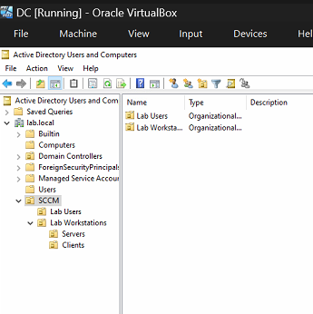
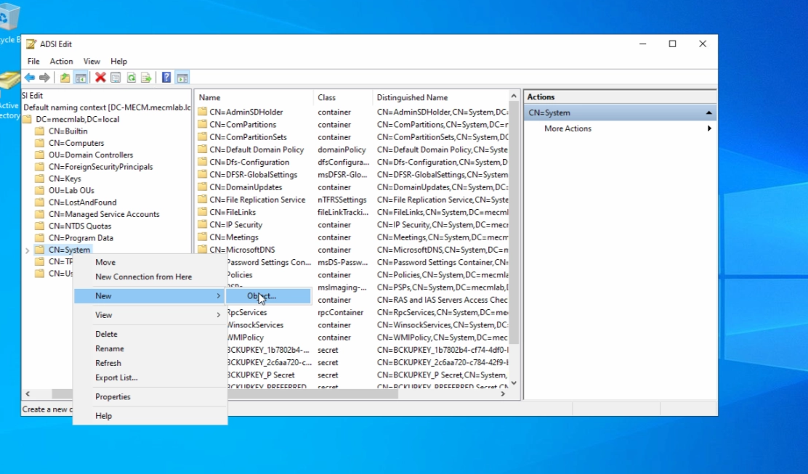

# Setting up SCCM

## Lab Topology (Note I am using 32 GB RAM workstation)

- Windows Server for Domain Controller (2 cores, 4 GB RAM) - IP: 10.0.0.1/24
- Windows Server for SCCM (now known as MECM) (3 cores, 10 GB RAM)  - IP: 10.0.0.2/24
- 1-2 Windows Clients\

## Side Note

My DC kept shutting off and i think it was because my eval license expired so i ran  

- slmgr /xpr
- slmgr /dlv

## Creating DC and SCCM servers

1. Start off by creating a VM and promoting it to become my DC. 
    1. Learned powershell way to promote VM to DC
        
        ```powershell
        Install-WindowsFeature -Name AD-Domain-Services -IncludeManagementTools
        
        # Do this one to verify the feature was installed. Can also see flag in server manager
        Get-WindowsFeature AD-Domain-Services
        ```
        
    2. Renamed this server to DC
    3. Referred to my previous doc  [Phase 1: Server and Client Setup Server and ](https://app.notion.com/p/Phase-1-Server-and-Client-Setup-Server-and-3184786e83ad8025b621f940b847a553?pvs=21) 
2. Created an OU called SCCM for this lab. Copying the local admin to create a SCCM Domain admin account to use instead of local admin.
3. Additionally we will create a service account for SQL
    1. Account name sql_srv
    
    
    
4. Next we are going to make system management container. So we return to the DC and open ADSI edit
5. On this menu click on “Action > connect to…” and make sure you path looks like your DC
    
    
  
6. Then open up into the system container and right click. Then “new > object”. 
    
    
    
    1. Then we are creating a new container called “System Management”
    
    
    
7. Then we want to open up AD Users and Groups, right click on the newly created container to “Delegate control”
    
    
    
8. This pops up a delegation wizard where we want to administer delgation permision the SCCM workstation.
    
    
    
9. Then “Create a custom task to delegate”. Leave the next “Delegate control of” page on defaults
10. In permission select “Full Control”
    
    
    
11. Now we must extend the AD Schema. So download the MECM installation media https://www.microsoft.com/en-us/evalcenter/download-microsoft-endpoint-configuration-manager?msockid=3eba47bd303e662f176450da316567ce
12. Extract the files to your preferred location, I did the C: Drive of my SCCM machine which has additional NAT adapter and used file sharing to copy files to DC.
    
    
    
13. Once extracted within that folder navigate to file path “ConfigMgr_2509\SMSSETUP\BIN\X64” and run as admin the file extadsch.exe (this will create extended AD schema for configuration manager)
    
    
    
14. This action can be verified by checking the ExtADsch.log file and looking for a Successfully extended AD schema message
    
    
    
15. 

### SCCM server set up

1. Create SCCM server and join it to the domain. Once that is complete I run time server query to make sure it is using the DC. This is crucial for kerberos auth which SCCM will need
    
    ```powershell
    w32tm /query /status
    ```
    
2. On the SCCM server go to disk management and create Disk Volume for SQL 
    
    
    
    
    
3. Also I read through this https://learn.microsoft.com/en-us/intune/configmgr/core/plan-design/configs/site-and-site-system-prerequisites to understand as a prereq for MECM we will need to install 
    1. .NET framework 3.5 & 4.8
    2. Windows ADK
    3. Visual C++ redistributable 2015-2022 
    4. IIS
    5. WSUS
4. So lets do this windows feature prep

### SQL server install on SCCM

1. I gave my SCCM server a NAT network adapter so that I could download SQL server 2022 from web. https://www.microsoft.com/en-us/evalcenter/download-sql-server-2022?msockid=3eba47bd303e662f176450da316567ce
2. Upon download open the file. I decided to choose Custom install for SQL Server 2022 Evaluation Edition to go through the full installation wizard
    
    
    
3. In the SQL Server Installation Center, navigate to Installation menu and click on “New SQL server…”. The following pop up will appear
    
    
    
4. I don’t have product key so in the Edition tab I pick “Evaluation” and click next. I accept license terms and I use microsoft update to check for updates and click next. 
5. Installer will check for updates and then perform a set up rules check and provide a report 
6. I got a Windows firewall warning. I clicked next but it is important tangent:
    1. in enterprise my SQL server and MECM server would not be on the same machine so i would need to open up TCP port 1433 for my default sql instance
        
        
        
7. I am not using Azure Extension for SQL server so uncheck and next
8. At the feature selection select the “Database Engine Services”. Next
    
    
    
9. Use the default instance for ease of life (however if you used the named instance that is a rabbit hole of SQL browser service and port rules. Fun but not necessary)
    
    
    
10. At the server configuration step set the SQL Server Agent and SQL Server Database Engine as the sql_srv service account. Additionally check the “Grant Perform Volume…” tldr the details tell you this optimizes SQL performance.
    1. FYI double check collation tab to be SQL_Latin1_General_CP1_CI_AS
    
    
    
11. You can add the domain admin or even make a security group to assign membership to this SQL server admins
    
    
    
12. Lets also install SQL Server Management Studio https://learn.microsoft.com/en-us/ssms/install/install?view=sql-server-ver16
13. I run the Visual Studio Installer, and at the workloads step I chose to download all, then install to keep this lab open to future exploration. 
14. Next open SSMS and connect to the SQL server we created on this device. Go to browse and pick the DB. Make sure to trust the server cert
    
    
    
15. Here you should see you DBs and under security logins you should see all the Users you added back in the server configuration step.
16. Now for quality of life working with the lab lets adjust the Max Memory usage of SQL since we have multiple VMs running on a physical machine
17. Right click on the SQL server and go to properties
    
    
    
18. Then click on Memory tab and lets set our Max server memory value somewhere in between 50%-60% of the total memory allocated to the VM for SCCM. 
    
    
    

### Prereqs for SCCM

1. Now we need to install windows ADK, WinPE add-on, and IIS features
2. Go to https://learn.microsoft.com/en-us/windows-hardware/get-started/adk-install in order to download windows ADK and the WinPE add-on
    1. make sure to download the version that is appropriate to your version off windows server
3. Once downloaded launch the windows ADK 
    
    
    
4. Select your preferences for Kit privacy and accept the license agreement. 
5. For SCCM you need the following features selected
    
    
    
6. Once the installation is complete launch the WinPE add-on launcher
7. This installer is simpler just click all the way through to install. 
8. Now lets go add IIS in the server roles and features of SCCM server
    
    
    
9. Make sure the following features are selected
    
    
    
    
    
10. Select the following Role Services 
    
    
    
    
    
    
    
11. Continue to the install.
12. Once install is complete open browser and type [http://localhost](http://localhost/) you should expect to see the following
    
    
    
13. Forgot to do this while installing IIS Open server manager and add the WSUS roles to the SCCM server.
14. In role services tab. Uncheck WID connectivity and select SQL server connectivity
    
    
    
15. For the location of the updates I point to the C: drive. I created a folder WSUS for this.
    
    
    
16. Make sure to check connection to  your SQL server. This is what you want to see
    
    
    
17. After going through the rest of the steps and completing the install you should see a SUSDB in your SQL database 
    
    
    
18. Restart your VM 

### MECM Installer

1. Now it is time to run the MECM installer.
2. Go to where you extracted your config manager files and run splash.hta
    
    
    
3. Once at the installer click on install 
    
    
    
4. Select “Install a Configuration Manager primary site” 
    
    
    
5. Select to install evaluation edition of this product. Click next. 
6. Accept the term and click next
7. At the prerequisite downloads page select download required files and store these in a centralized location. I chose my C: drive for ease. Click next 
    
    
    
    1. The files may take a while
8. Click english for language selection
9. Make your site code something meaningful. I am using LAB. Make the site name something human readable 
    
    
    
10. Select “Install the primary site as a stand-alone site”
    
    
    
11. If you used default instance for SQL, you can leave the Database Information as defaults 
    
    
    
12. You can leave SQL data and log files paths as defaults.
13. Install the SMS provider locally on the server
    
    
    
14. In client Computer Communication Settings, choose “Configure the communication method on the site system role”
15. You can leave the page of Site System Roles as default 
    
    
    
16. You can leave configuration manager updates on and as defaults
    
    
    
17. You can click next on the settings summary and allow prereq check to run
18. Once the prereq check is done review the warning and make sure you are void of errors.
    
    
    
19. Once prereq check looks good you can begin install
    
    
    
20. **NOTE:** my installer kept failing at the “Setting up the SQL Server database accounts” after investigating the errors in the logs the resolution was rolling back the OBDC 18 version from the newest 18.6.1.1 to version 18.5.2.1 see this site https://learn.microsoft.com/en-us/sql/connect/odbc/windows/release-notes-odbc-sql-server-windows?view=sql-server-ver17#previous-releases
    
    
    
21. Once the MECM configuration is complete you will see this screen
    
    
    
22. Now open up Microsoft Configuration Manager and verify that it connects to your server 


