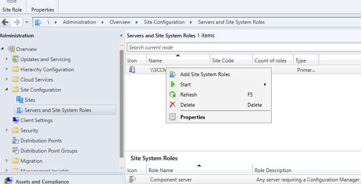

# Software Updates

### Adding Software Update Point Role

1. In the Configuration Management Console. Navigate to Administration > Site Configuration > Servers and Site System Roles. If the Software Update role is not present we are going to add it. 
    1. Right click on your server and select Add Site System Roles 
        
        
        
    2. In general and in proxy tabs click next. Then select the Software update point role
        
        
        
    3. Based on our current environment we can leave the Software Update Point page as defaults 
        
        
        
    4. Since WSUS is installed on the same machine as MECM we can leave everything in Proxy and Account Settings unchecked.
    5. In Synchronization Source leave the defaults 
        
        
        
    6. Don’t create a sync schedule. Move onto next page. 
    7. For our lab environment we are going to set both supersedence behaviors to immediately expire. 
        1. Normally in enterprise environment we would want to set a grace period to verify the new update isn’t causing any issues. This makes rollback easier.
        
        
        
    8.  In maintenance configure the following. This will optimize for the limited resources in our lab environment
        
        
        
    9. You can leave the Maximum run times as default
        1. Dont worry this will not terminate an update (i know i thought the same thing) but rather it stops monitoring and helps with maintenance window calculations.
            
            
            
    10. Leave Update Files as Download full files for all approved updates (this is so you server doesnt have to such large update packages)
    11. In Classifications tab, for our lab the 2 most important are Critical Updates (for non security bugs)  and Security Updates (for CVEs and other vulnerabilities)
        
        
        
    12. In Products Tab, click the plus sign next to All products and follow the path Microsoft > Windows > Windows 11 (you may have to choose 10 as a place holder if 11 is not available. Should become available after first sync)
    13. In languages leave only English checked for both boxes and finish going through the Add Site Role wizard
        
        
        
    14. You will now see the Software update point role in the Servers and Site System Roles of this server
        
        
        
    

### Performing a Synchronization

1. Okay lets trigger the initial synchronization for windows updates. Navigate to Software Library > Software Updates > All Software Updates and click on the synchronize software updated button
    
    
    
2. This will take a while (I am talking upwards to an hour of time. Refer to wsyncmgr.log for live status of the sync).
    1. My sync ended early so I had to research what the log messages meant and I ran the sync again
        
        
        
    2. Got the same warning on second run. I navigated to the WSUS console in products to see if I could sync windows 11 updates natively. I ran manual sync on WSUS
        
        
        
    3. Then in MECM console I ran synchronization again but check windows 11 in products of SUP configuration
        
        
        
3. After the synchronization completes, you should expect to see a whole lot of updates available in the Software Library > Software Updates > All Software Updates
    
    
    

### Create a Software Update Group and Deployment Package`

1. Now we will create a software update group which we use to group together updated we intend to deploy together. 
2. In All Software Updates filter the updates by Adding Criteria for Product, Update Classification, Superseded, and Date Released or Revised
    
    
    
3. Once added, update the criteria to reflect the following:
    1. Product: Windows 11
    2. Update Classification:n Security Updates, Critical Updates
    3. Superseded: No
    4. Date Released or Revised: Last 3 months (this is should reflect your intended simulated patch cycle)
4. Pick the most recent Cumulative Update for the OS of your respective VM
    
    
    
    
    
5. Right click on this update and select Create Software Update Group
6. Name this update group something descriptive and easy to make consistent like “Lab - Windows 11 Security - June 2026”
    
    
    
7. Now create a folder for MECM to stage the update content I created the following 
    
    
    
8. On your newly created Software Update Group, right click and select Download
    
    
    
9. In the Download Software Updates Wizard, select Create a new deployment package. Fill the first page accordingly
    
    
    
10. In the next page for Distribution Points we will point to the SCCM since it is our only DP in the environment right now. 
    
    
    
11. In the distribution settings I left everything as default since I only have 1 DP
12. Then in download location I selected Download Software Updates from the Internet 
    1. Remember this SCCM server in my environment has NAT adpater
13. I left the update languages as default. Click through and complete the wizard. 

### Deploying the Software Update Group

1. Now that we have our software update ready lets deploy. In Software Update Groups menu select the Windows 11 SUP we created and click on deploy
    
    
    
2. We are going to deploy this our Pilot Ring collection. So lets point to this in the General tab of the deployment wizard
    
    
    
3. In deployment settings make the Type of Deployment as Required. 
    1. Do no select wake on LAN. Patching assumes a device is already on. 
4. Set the Status message detail level to Only error messages. 
    
    
    
5. In Scheduling tab leave Schedule evaluation as Client local time and Software available time to As soon as possible
    1. For installation deadline good practice is to align it with patch/maintenance window but for now since we want this update to install I will set it to a couple hours out from creation of this deployment.
        
        
        
6. In user experience set the following
    
    
    
    1. This will allows to observe MECM in action on our client
7. Make sure to take a really good glance at the alerts tab. Consider what would be useful in production. Because in this lab I am skipping it since my environment is so small. 
8. For a single site, single DP environment I am going to set the following for Download Settings
    1. Consider use case of other settings
        
        
        
9.  Complete the wizard    


### Verify Update

1. Go to the Client workstation. Navigate to Control Panel > Configuration Manager > Actions tab. Run the following 3 actions
    
    
    
2. Also recommend looking at UpdatesDeployment.log for indications of success
    1. I got the messages below which show 1 updated was detected and that the device is already compliant which means the update is installed
        
        ```xml
        <![LOG[Assignment {E51D3FCD-2EB9-4D86-A971-5071CCF31C05} has total CI = 1]LOG]!><time="17:56:20.575+420" date="06-07-2026" component="UpdatesDeploymentAgent" context="" type="1" thread="8160" file="updatesassignment.cpp:166">
        .
        .
        .
        IsCompliant = True]LOG]!><time="17:56:27.197+420" date="06-07-2026" component="UpdatesDeploymentAgent" context="" type="1" thread="3568" file="assignmentpolicy.cpp:1579">
        ```
        
3. Going to the update history shows that this update was installed on 5/30 around the timewhen I created the VM so the update I am trying to install is already on the machine. 
4. This is also verified in MECM console monitoring for this deployment

